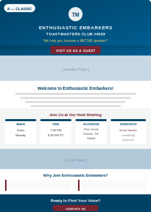
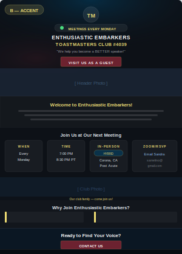
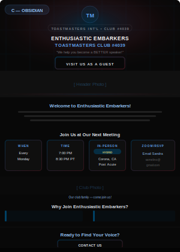

# FTH Homepage Generator

FTH (Free Toast Host) is the official Toastmasters club website platform. This skill generates
the HTML for the **Homepage zone** (main content area) of an FTH site. The HTML is pasted
directly into the "Main Heading" textarea in FTH's Site Administration panel.

See [references/fth.md](references/fth.md) for FTH platform constraints.
See [references/brand.md](references/brand.md) for Toastmasters brand requirements.

## Workflow

### Step 1 - Collect club information

Ask the user for the following. Collect all in one message if possible:

| Field | Example |
|---|---|
| Club name | Enthusiastic Embarkers |
| Club number | 4039 |
| Tagline / motto | "We help you become a BETTER SPEAKER!" |
| Short intro (2-4 sentences) | About the club, what makes it unique |
| Meeting day(s) | Every Monday |
| Meeting time | 6:00 PM - 08:00 PM |
| Location type | In-Person / Zoom / Hybrid |
| Meeting location | 123 Main St, Anytown, CA — or — RSVP contact name + email for Zoom |
| Contact email | club@example.com |
| Header photo URL (optional) | Imgur or Google Drive link — leave blank for universal default |
| Mid-section photo URL (optional) | Leave blank for universal default |
| Social media (optional) | FB: https://facebook.com/... · IG: https://instagram.com/... |

**Default universal photos (use when user provides none):**
- Header: `https://raw.githubusercontent.com/Bond7010/tm-brand-kit-assets/main/assets/universal-header-photo.jpg`
- Mid: `https://raw.githubusercontent.com/Bond7010/tm-brand-kit-assets/main/assets/universal%20mid-section.png`

**Official TM logo (always use this — no upload needed):**
`https://raw.githubusercontent.com/Bond7010/tm-brand-kit-assets/main/assets/logos/ToastmastersLogo/ToastmastersLogoColor.png`

If the user provides partial info, proceed with placeholders and note what needs to be filled in.
If social media links are not provided, **omit the social section entirely** — do not add placeholder links or ask again. Only include the social section when at least one link is supplied.

### Step 1.5 - Style Selection (REQUIRED before generating)

After collecting club info, present the three style options **with visual previews** and ask the user to choose **before** generating any HTML. Do not generate until the user picks.

Show the previews using this exact markdown (the images are hosted on GitHub and will render inline):

---

**Which visual style would you like for your homepage?** Pick A, B, or C:

**A — Classic** · White background · Loyal Blue + True Maroon · Clean & professional

---

**B — Accent** · Dark `#0d1117` · Frosted glass cards · Gold highlights · Fade-up animations

---

**C — Obsidian** · Deep black `#080808` · Grid texture hero · Gradient borders · Shimmer CTA

---

Output filenames:
- Classic → `output/{club-slug}-homepage.html`
- Accent → `output/{club-slug}-homepage-accent.html`
- Obsidian → `output/{club-slug}-homepage-obsidian.html`

All three styles must: include the required TM disclaimer, use Montserrat + Source Sans 3, embed all CSS inline, and maintain FTH paste compatibility.

---

### Step 2 - Generate the HTML

Generate a complete, self-contained HTML page using the asset template at
[assets/homepage-template.html](assets/homepage-template.html) as the base.

Replace all {{PLACEHOLDER}} tokens with the collected information.

**Key generation rules:**
- All CSS must be inline in `<style>` tags — no external .css files
- JavaScript must be embedded in `<script>` tags — keep it minimal (or omit entirely)
- Google Fonts via `<link>` tag is allowed (it is a URL, not a file)
- Use Montserrat for headings, Source Sans 3 for body text (both free Google Fonts)
- Apply brand colors: Loyal Blue #004165, True Maroon #772432
- The required disclaimer must appear at the bottom (see brand.md)
- Always use the GitHub-hosted TM logo — no upload needed:
  `https://raw.githubusercontent.com/Bond7010/tm-brand-kit-assets/main/assets/logos/ToastmastersLogo/ToastmastersLogoColor.png`
- Always include a **header photo** section (below the hero) and a **mid-section photo** (between meeting cards and benefits). Use user-supplied URLs or fall back to the universal defaults above.
- Include **mobile responsive CSS** with `@media(max-width:540px)` breakpoints
- Accent style must use `acc-*` CSS class prefix (not `fth-*`) and include:
  - Animated `ping` status dot badge showing meeting day + location type
  - `fadeSlideUp` keyframe animations staggered per section
  - Frosted glass cards (`backdrop-filter:blur`) with hover `border-color` transition
  - Gradient text (`-webkit-background-clip:text`) on the club name subtitle line
- Obsidian style uses `obs-*` prefix with grid-texture hero, shimmer CTA border, `glowPulse` animation
- Meeting cards vary by location type:
  - **Zoom**: "How to Join" card with RSVP name + email link
  - **In-Person**: "Where" card with venue/address
  - **Hybrid**: "Where" card with `.fth-hybrid-badge` pill + optional Zoom RSVP card
- Social section: use emoji icons (📘 Facebook, 📷 Instagram) with pill-style bordered links; omit entirely if no links provided

### Step 3 - Deliver output

Present the complete HTML in a code block ready to copy-paste into FTH.

Tell the user:
1. Log in to your FTH admin panel
2. Go to **Site Administration**
3. Click the **Source** button in the Main Heading editor
4. Paste the HTML code
5. Click **Save / Close**

### Step 4 - Offer refinements

Ask if the user wants to adjust colors, layout, sections, or content blocks.
Common customizations: add a photo, change the CTA button, add social media links, add officer roster.
